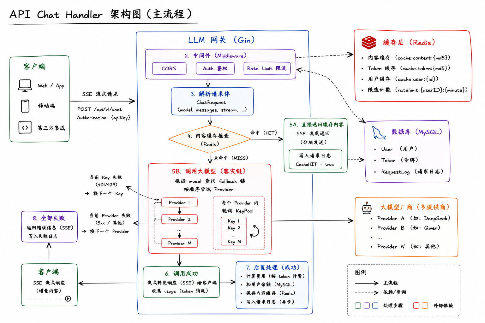
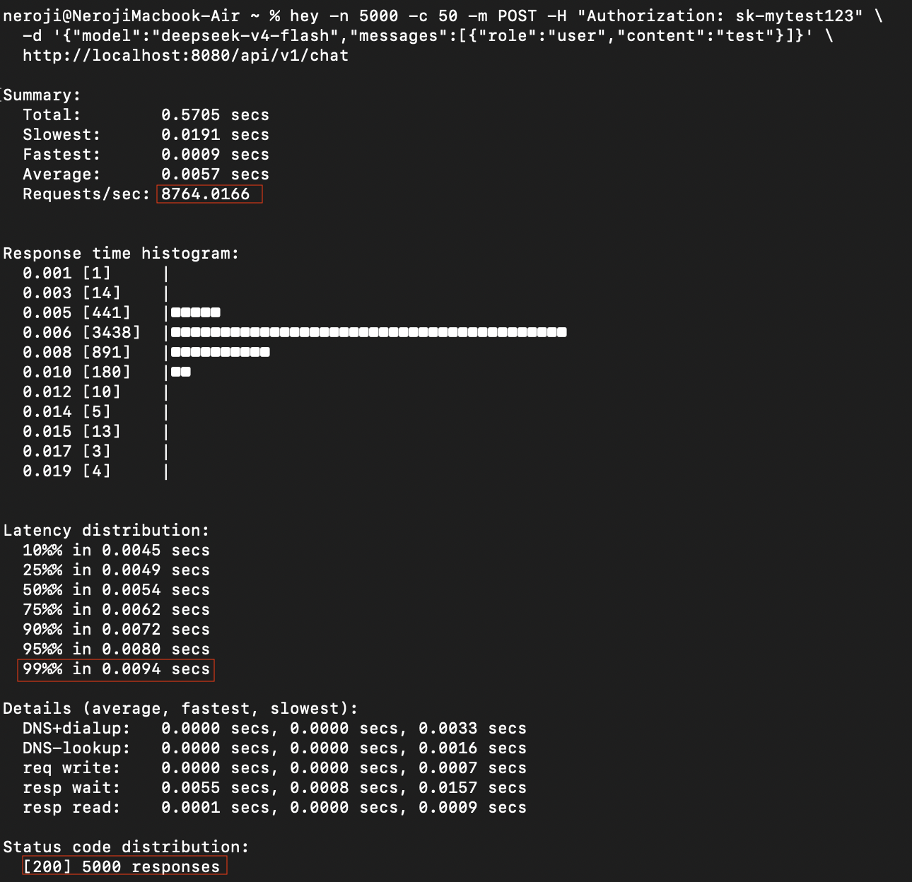
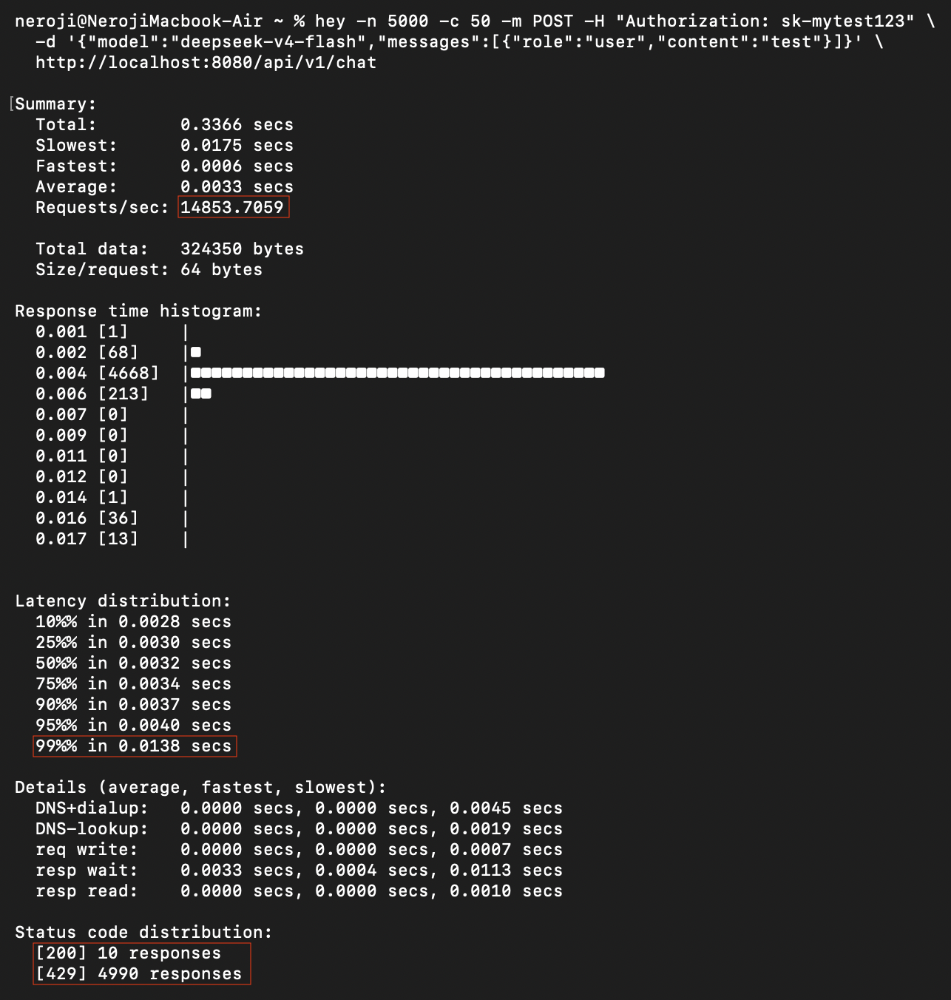

# Go-LLM-Gateway (高性能大模型 API 网关)

本项目是我在大二期间为了深入学习 **Go 并发编程**与**高性能后端架构**而开发的实战项目 。它不仅是一个支持 OpenAI 格式的统一代理网关，更完整记录了我从“同步阻塞”到“异步高性能架构”的演进过程 。底下还有docker部署并且给api测试的简易教程。

---
## 📚最终的核心路由架构图

---

## 🚀 核心性能指标 (Benchmarks)
经 `Hey` 工具实测（并发 50），本项目在核心链路上表现如下 ：

* **QPS**: 本地环境单机测试（MBAm2 8核8g）并且 命中缓存 的情况下 **8700+** 。
* **延迟**: P99 稳定在 **10ms** 以内 。

<details>
  <summary>🔍 点击查看 QPS & 延迟测试截图</summary>
  <br>
  
</details>                          
<p></p> 

* **拦截响应**: 分布式限流在 **1.5万+ QPS** 的恶意刷量场景下（限流拦截），依然保持微秒级拦截响应 。

<details>
  <summary>🛡️ 点击查看限流拦截效果图</summary>
  <br>
  
</details>


## 🛠 架构演进之路 
本项目按照开发顺序划分为 5 个阶段，每个文件夹代表一个性能里程碑。这种目录结构展示了系统是如何一步步通过调优解决性能瓶颈的。

### Phase 1 & 2: 基础代理与 Key 池化
**对应目录**: `01-stream-proxy-basic`, `02-api-key-pooling` 
* **流式转发**: 实现基于 **SSE (Server-Sent Events)** 的流式传输，对接 OpenAI 格式流 。
* **Key 池调度**: 设计并实现多厂商（如 DeepSeek、Qwen）的 API Key 池化管理，支持多密钥请求调度与容灾切换 。

### Phase 3: 协议适配与中间件化
**对应目录**: `03-multi-provider-adapter`
* **框架重构**: 引入 **Gin 框架** 进行路由重构，并编写自定义鉴权中间件保障接口安全 。
* **格式统一**: 负责请求序列化、响应解析及跨厂商的统一封装 。

### Phase 4: 异步架构性能调优 (关键里程碑)
**对应目录**: `04-gin-middleware-refactor`
* **解决 DB I/O 瓶颈**: 在基准测试中发现数据库同步 I/O 成为主干链路阻塞点 。
* **Channel 异步化**: 利用 **Channel 缓冲队列** 重构日志异步落库机制，消除阻塞，使单机 QPS 实现质的飞跃 。

### Phase 5: 高可用加固与缓存优化
**对应目录**: `05-high-availability-cluster`
* **多级缓存设计**: 接入 Redis 维护 Token 鉴权信息，通过提取请求特征生成 **MD5 短 Key** 建立索引，优化内存占用与查询延迟 。
* **防御机制**:
    * **防雪崩**: 结合随机时间抖动 (**Jitter**) 有效防止大规模缓存同时失效 。
    * **防刷量**: 编写并注入 **Redis Lua 脚本** 实现分布式限流，确保超高并发下的原子性操作 。

---

## 💻 技术栈
* **语言**: Go (Goroutine, Channel, Context) 
* **框架**: Gin, GORM 
* **存储**: MySQL (索引/锁优化), Redis (Lua 脚本/缓存策略) 
* **协议**: HTTP/SSE, TCP/IP
* **部署**: Docker, Docker Compose
* **测试**: Postman

---

## 🐳 本地部署

依赖：装好 [Docker](https://www.docker.com/products/docker-desktop/) 就行，不需要本地装 Go / MySQL / Redis。

**第一步：获取代码**

```bash
git clone https://github.com/Neroxji/Go-LLM-Gateway.git
cd Go-LLM-Gateway
```

**第二步：填写你自己的 API Key**

编辑 `05-high-availability-cluster/config.json`，把 `keys` 换成自己的。并且可以自己尝试放很多不同的厂商的大模型😺

```json
{
  "providers": [
    {
      "name": "deepseek",
      "url": "https://api.deepseek.com/chat/completions",
      "model": "deepseek-v4-flash",
      "keys": ["Bearer sk-你的key"],
      "price_per_k": 500
    }
  ],
  ...
}
```

**第三步：按需修改密码（可选）**

`docker-compose.yml` 里默认密码是 `123456`，自己部署的话改一下，两处要一致：

```yaml
MYSQL_ROOT_PASSWORD: 你的密码
DSN: "root:你的密码@tcp(mysql:3306)/ai_gateway?..."
```

**第四步：构建 & 启动**

```bash
docker build -t aigateway:v1.0 .
docker-compose up -d
```

第一次会拉基础镜像，稍微等一下。跑完之后：

```bash
docker-compose ps        # 三个容器都是 Up 就说明正常
docker-compose logs app  # 看有没有报错
```

服务启动后监听 `http://localhost:8080`。

**停止服务**

```bash
docker-compose down          # 停止，数据保留
docker-compose down -v       # 停止并清掉数据库数据
```

---

> config.json 是通过 volume 挂载进容器的，修改 API Key 后直接 `docker-compose restart app` 生效，不需要重新 build 镜像。

---

## 🧪 API 测试（Postman）

服务跑起来后，按以下顺序调用接口。

### 第一步：创建用户

```
POST http://localhost:8080/admin/users/create
Content-Type: application/json
```

```json
{
  "username": "testuser",
  "balance": 100000
}
```

返回示例：
```json
{
  "message": "create user successfully!",
  "user_id": 1,
  "balance": 100000
}
```
<details>
  <summary>📸 点击查看创建用户测试截图</summary>
  <br>
  
  <br><br>
  
</details>

---

### 第二步：给用户创建 Token

```
POST http://localhost:8080/admin/tokens/create
Content-Type: application/json
```

```json
{
  "user_id": 1,
  "name": "我的测试密钥"
}
```

返回示例：
```json
{
  "message": "create token successfully!",
  "token_id": 1,
  "token_key": "sk-xxxxxx"
}
```

把 `token_key` 的值复制下来，下一步要用。
<details>
  <summary>🔑 点击查看创建 Token 测试截图</summary>
  <br>
  
  <br><br>
  
</details>

---

### 第三步：发起对话请求

```
POST http://localhost:8080/api/v1/chat
Authorization: Bearer sk-xxxxxx（上一步拿到的 token_key）
Content-Type: application/json
```

```json
{
  "model": "deepseek-v4-flash",
  "messages": [
    {
      "role": "user",
      "content": "你好"
    }
  ]
}
```

网关会自动选择可用的 Provider 转发请求，支持SSE流式响应。
<details>
  <summary>💬 点击查看对话请求（SSE流式）测试截图</summary>
  <br>
  
</details>


---

### 其他：禁用用户

```
DELETE http://localhost:8080/admin/users/:id
```

把 `:id` 替换成具体的用户 ID，例如 `/admin/users/1`。执行后该用户的 Token 将无法继续使用。
